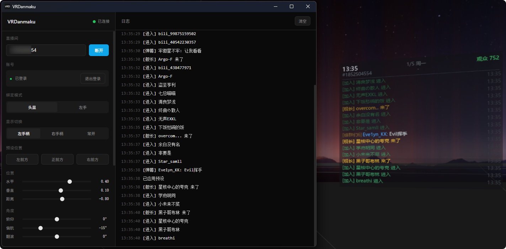

> 软件目前仅支持 哔哩哔哩直播平台  
> 交流群：1047423396

# VRDanmaku
一款面向 **SteamVR** 的哔哩哔哩弹幕姬工具，支持在 VR 中实时显示弹幕与互动信息。

  

## 首次启动
1. 下载 `VRDanmaku.exe` 软件。
2. 启动 SteamVR，并确保 VR 设备已正常连接
3. 在 SteamVR 界面中启动 `VRDanmaku.exe` 。
4. 点击 **登录** 按钮，等待二维码弹出。
5. 使用手机哔哩哔哩客户端扫描二维码进行登录。
6. 在输入框内填入目标直播间的房间号。
7. 点击 **连接**。
8. 完成，后续只需要启动并点击连接即可使用。

## 了解更多
交流群：**1047423396**  
面向 开发者、SteamVR 用户、VRChat 玩家
